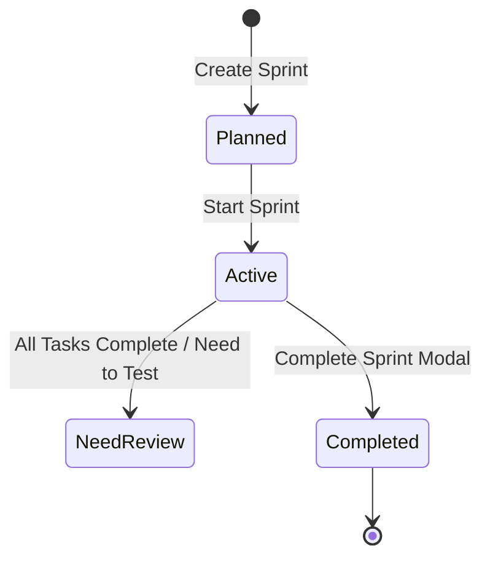
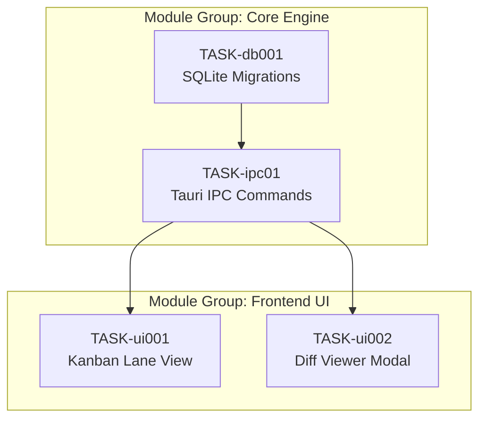
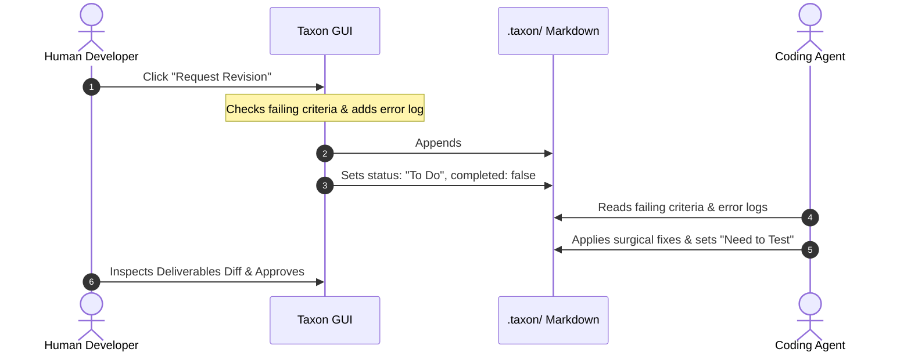

# Taxon GUI User Guide

Taxon is a local-first, privacy-focused task and project manager built with **React 18**, **Tauri 2 (Rust)**, and **Tailwind CSS**. It bridges personal daily productivity (Kanban boards, Pomodoro timer, calendars) with **autonomous AI agent orchestration** (Task Dependency Graphs, Git Worktree sandboxes, Deliverables Diff inspection, and Revision protocols).

This guide walks developers through the GUI workflows, navigation patterns, and human-in-the-loop agent verification cycles.

---

## Table of Contents

1. [Runtime Environments](#1-runtime-environments)
2. [Interface Anatomy & Global Layout](#2-interface-anatomy--global-layout)
3. [Keyboard & Positional Vim Navigation](#3-keyboard--positional-vim-navigation)
4. [Projects, Categories & Local Storage](#4-projects-categories--local-storage)
5. [Sprint Planning & Burndown Lifecycle](#5-sprint-planning--burndown-lifecycle)
6. [Daily Execution Modes](#6-daily-execution-modes)
   - [Kanban Board](#kanban-board)
   - [Task List & Detail Panel](#task-list--detail-panel)
   - [Calendar & Scheduled Views](#calendar--scheduled-views)
   - [Pomodoro Focus Mode](#pomodoro-focus-mode)
   - [Productivity Analytics](#productivity-analytics)
7. [Autonomous AI Agent Orchestration](#7-autonomous-ai-agent-orchestration)
   - [Task Graph (DAG) & Theater Mode](#task-graph-dag--theater-mode)
   - [Bidirectional File Sync (`.taxon/`)](#bidirectional-file-sync-taxon)
   - [Git Worktree Sandboxes & Native Launchers](#git-worktree-sandboxes--native-launchers)
   - [Deliverables Diff Viewer & Inline Remediation](#deliverables-diff-viewer--inline-remediation)
   - [Revision Request Protocol & Circuit Breaker](#revision-request-protocol--circuit-breaker)
8. [End-to-End Developer + Agent Pairing Recipe](#8-end-to-end-developer--agent-pairing-recipe)
9. [Keyboard Shortcuts Reference](#9-keyboard-shortcuts-reference)

---

## 1. Runtime Environments

Taxon runs in two distinct environments during development:

```
┌─────────────────────────────────┬───────────────────────────────────────────┐
│ Desktop Environment             │ Browser Preview                           │
│ pnpm tauri dev                  │ pnpm dev                                  │
├─────────────────────────────────┼───────────────────────────────────────────┤
│ • Production-grade SQLite DB    │ • In-memory mock storage                  │
│ • Local Git worktree commands   │ • Mocked diff / file trees                │
│ • Filesystem vault sync (.taxon)│ • No native terminal or editor launchers  │
│ • Native external app launchers │ • Fast UI styling / component iterations  │
└─────────────────────────────────┴───────────────────────────────────────────┘
```

> **Developer Note**: Use `pnpm tauri dev` when testing Git worktrees, terminal/editor launchers, diff viewers, and `.taxon/` markdown synchronization.

---

## 2. Interface Anatomy & Global Layout

Taxon's OLED-optimized interface minimizes distraction with dedicated operational zones:

```
┌─────────────────┬───────────────────────────────────────────────────────────┐
│ SIDEBAR         │ TOP APPLICATION BAR                                       │
│ [⌘K] Spotlight  │ Current View / Project Title  •  Pomodoro Status  •  Sync │
│                 ├───────────────────────────────────────────────────────────┤
│ Views:          │ MAIN VIEWPORT / WORKSPACE                                 │
│ • Dashboard     │                                                           │
│ • Projects      │ [ List ]  [ Kanban ]  [ Workflow (DAG) ]                  │
│ • Todo List     │ Filter: [ All | To Do | In Progress | Need to Test | ... ]│
│ • Calendar      │ Sprint: [ Sprint 13 ▼ ]                                   │
│ • Work Log      ├───────────────────────────────────────────────────────────┤
│ • Recurring     │                                                           │
│ • Analytics     │  Task cards / Interactive DAG / Split Diff Editor         │
│                 │                                                           │
│ Categories:     │                                                           │
│ 1. Core         │                                                           │
│ 2. Portfolio    │                                                           │
│ 3. Freelance    │                                                           │
└─────────────────┴───────────────────────────────────────────────────────────┘
```

### Key UI Sections
- **Sidebar**: High-level view navigation, category groupings, project hierarchy, and pinned project slots.
- **Top Bar**: Search trigger (`⌘K`), quick-add task (`⌘N`), active Pomodoro timer widget with start/pause toggles (`⌘⇧P`), and vault sync health indicator.
- **Main Stage**: Context-sensitive container rendering project views (List, Kanban, Workflow DAG, Diff Viewer) or global tools (Dashboard, Analytics, Calendar, Settings).
- **Detail Overlays & Modals**: Transient panels for task inspection, project editing, diff review, and keyboard cheatsheet (`?`).

---

## 3. Keyboard & Positional Vim Navigation

Taxon provides full mouse-free operation using a combination of modal chord sequences, global shortcuts, and a universal escape stack.

### Positional Vim Jumping (`g <category> <project>`)
Jump directly to any project without searching or clicking:
1. Press `g` to enter jump mode (visual badge indicators appear in the sidebar).
2. Press a number `1..9` corresponding to the category index.
3. Press a second number `1..9` corresponding to the project index within that category.
4. Taxon immediately loads the selected project.

### Global View Jumps
| Shortcut | Action |
|---|---|
| `g d` | Go to Dashboard |
| `g p` | Go to Projects overview |
| `g t` | Go to Todo list |
| `g c` | Go to Calendar (Scheduled) |
| `g w` | Go to Work Log (History) |
| `g r` | Go to Recurring tasks |
| `g a` | Go to Analytics |
| `g s` | Go to Settings |
| `Alt 1..9` | Switch directly to pinned project 1 through 9 |
| `j` / `k` | Move cursor down / up across lists |

### Universal Escape Stack (`Esc`)
Pressing `Esc` dismisses UI layers in deterministic reverse order:
1. Active modal window or popup (e.g. Diff Viewer, Revision Request).
2. Open dropdown menus and comboboxes.
3. Active Vim jump chord sequence (`g`).
4. Fullscreen Focus Mode or Workflow Theater Mode.

---

## 4. Projects, Categories & Local Storage

Projects are organized under categories and optionally linked to local filesystem directories.

### Creating & Configuring Projects
1. Click **+ New Project** in the sidebar or press `⌘K` and type `Create Project`.
2. Configure project attributes:
   - **Name & Description**: Core identification.
   - **Category**: Grouping label (e.g., `Infrastructure`, `Frontend`, `API`).
   - **Vault Path**: Absolute path to a local directory or Obsidian vault where `.taxon/` markdown task contracts will sync.
   - **Workspace Paths**: One or more local Git repository checkouts where coding agents will execute tasks and spawn worktrees.
   - **Due Date & Pinned Status**: Pin critical projects to the top of the sidebar for instant `Alt 1..9` switching.

### Local Vault Architecture
When a project has a **Vault Path** set:
- `.taxon/project.md`: Project metadata and task directory index (read-only context for agents).
- `.taxon/tasks/*.md`: Task contracts containing YAML frontmatter and markdown specifications.
- `.taxon/sprints/*.md`: Sprint definitions, goals, and task assignment manifest.

---

## 5. Sprint Planning & Burndown Lifecycle

Taxon structures iterative engineering work into Sprints.



### Sprint Management Workflow
1. **Create Sprint**: In the Project Detail view, open the Sprint selector and click **Create Sprint**. Set a name, date range (`YYYY-MM-DD`), and the core `## Goal` objective.
2. **Assign Tasks**: Move tasks between Backlog and the active sprint via:
   - Task detail dropdown.
   - Drag-and-drop on the Kanban board.
   - Sprint filter selector at the top of the Project view.
3. **Sprint Goals Viewer**: Sprint goals render using GitHub-flavored Markdown. Use standardized sections:
   - `### Objective`
   - `### Key Deliverables` (grouped into 2 to 4 architectural module groups)
   - `### Success Metrics`
4. **Complete Sprint**: Click **Complete Sprint** to trigger the completion dialog:
   - Review accomplished tasks vs incomplete tasks.
   - Choose rollover behavior for uncompleted items (roll over to next planned sprint or return to project backlog).

---

## 6. Daily Execution Modes

### Kanban Board
Navigate to any project and switch to the **Kanban** tab (`viewMode = 'kanban'`).

```
┌───────────────┬───────────────────┬───────────────────┬───────────────┐
│ TO DO         │ IN PROGRESS       │ NEED TO TEST      │ DONE          │
├───────────────┼───────────────────┼───────────────────┼───────────────┤
│ [TASK-101]    │ [TASK-102] 🌳     │ [TASK-103] 🔍     │ [TASK-100]    │
│ Setup DB      │ Wire IPC bridge   │ Diff ready        │ Auth schema   │
│ P: Critical   │ P: High           │ P: High           │ P: High       │
└───────────────┴───────────────────┴───────────────────┴───────────────┘
```

- **Drag-and-Drop**: Drag task cards across lanes to update statuses in real-time.
- **Status Indicators**:
  - 🌳 **Worktree Active**: Indicates an active Git worktree sandbox checkout.
  - 🔍 **Diff Ready**: Signals deliverables are waiting for review in `Need to Test`.
  - ⚡ **Escalated / Circuit Breaker**: Highlights tasks that hit repeated rejection thresholds.

### Task List & Detail Panel
The **List** view provides tabular density for rapid task grooming:
- **Filters**: Quickly cycle through statuses (`To Do`, `In Progress`, `Need to Test`, `Done`, `Archived`) by clicking tab badges.
- **Task Detail Inspection**: Click any task row to open the comprehensive Task Detail Drawer:
  - Edit priority, due dates, subtasks, recurrence, and module groups.
  - View rendered markdown specs (`## Description`, `## Acceptance Criteria`).
  - Access agent orchestration panels (Worktrees, Diffs, Revisions).

### Calendar & Scheduled Views
Access via `g c` or sidebar:
- Visual monthly/weekly calendar grid tracking task deadlines and sprint milestones.
- Drag tasks onto calendar cells to reschedule due dates.

### Pomodoro Focus Mode
Trigger with `⌘F` (Toggle View) or `⌘⇧P` (Start/Pause Timer):
- **OLED Black Immersion**: Minimizes all navigation controls, leaving only the active task title, acceptance criteria checklist, and a countdown timer.
- **Interval Management**: 25-minute work intervals followed by 5-minute short breaks and 15-minute long breaks.
- **Quick Logging**: Completed focus intervals automatically record entries to the project's **Work Log** history (`g w`).

### Productivity Analytics
Access via `g a` to review velocity and health metrics:
- Task throughput over 7, 30, and 90-day intervals.
- Completion distribution across priorities (`Critical`, `High`, `Medium`, `Low`).
- **First-Pass Success Rate**: Ratio of tasks approved directly from `Need to Test` without requiring a Revision Request.

---

## 7. Autonomous AI Agent Orchestration

Taxon is designed to coordinate external autonomous AI coding agents (such as Claude Code, Gemini CLI, Cursor, and Aider) without requiring an in-app language model runtime.

### Task Graph (DAG) & Theater Mode
Switch to the **Workflow** tab in any project to inspect the Directed Acyclic Graph:



- **Module Groups**: Automatically groups nodes into architectural clusters (2–4 groups per sprint).
- **Bus Edges & Dependency Lines**: Arrows reflect `dependsOn` declarations from task frontmatter.
- **Workflow Theater Mode**: Click the **Full-screen Pop-out** button (top right of workflow toolbar) to open the DAG in an expansive, distraction-free viewport.
- **Interactive Node Selection**: Clicking any DAG node opens its contract details and linked deliverables.

### Bidirectional File Sync (`.taxon/`)
Open the **Agent Sync Panel** in the project sidebar to manage filesystem coordination:
- **Export to Agent (`.taxon/`)**: Writes SQLite projects, sprints, and tasks into human- and agent-readable Markdown files with YAML frontmatter.
- **Scan for Changes**: Scans `.taxon/` for modifications made by agents or text editors and presents a visual diff modal.
- **Confirm Import**: Atomically merges filesystem changes back into SQLite.
- **Git Hook Setup**: Installs `.taxon/hooks/post-commit` to automatically transition committed tasks to `Need to Test`.

### Git Worktree Sandboxes & Native Launchers
When a task enters execution, Taxon isolates changes using Git worktrees:

```
/mnt/Linux/Projects/my-app/              <-- Main Repository (Clean)
└── .worktrees/
    └── TASK-a1b2c3-auth-flow/          <-- Worktree Sandbox (Branch: feat/TASK-a1b2c3)
        ├── node_modules/ -> (symlinked) <-- Dependency Bridging
        └── src/
```

- **Worktree Control Panel**: Located in the Task Detail view when a task has an associated workspace.
- **Native Sandboxed Launchers**:
  - **Terminal**: Spawns your terminal emulator (e.g. Kitty, Alacritty, GNOME Terminal) directly in the worktree directory.
  - **Code Editor**: Launches VS Code or your configured `$EDITOR` rooted in the worktree.
- **Interactive Merge & Safe Conflict Abort**:
  - When a task passes review, click **Merge Changes** to merge the branch back into the main branch.
  - If a Git conflict occurs, Taxon halts the merge, runs `git merge --abort` to keep the main repo clean, and leaves the worktree intact for manual resolution.

### Deliverables Diff Viewer & Inline Remediation
When a task is set to `status: Need to Test`, the **Deliverables Diff Viewer** activates:
- **Baseline Git Comparison**: Compares the worktree against `baseCommit` (the commit recorded when execution began).
- **Two-Tier Classifier**:
  - **Declared Deliverables**: Files explicitly declared in the task contract `outputs`.
  - **Collateral Changes**: Unannounced modified files in the repository.
- **Split & Unified Modes**: View side-by-side or inline syntax-highlighted diffs.
- **Inline Remediation**: Reviewers can edit code directly inside the diff view and press **Save** (`⌘S`) to auto-save fixes to disk without opening an external editor.
- **Acceptance Checklist Bar**: Check off criteria from the contract markdown. Once all criteria pass, click **Approve & Commit**.

### Revision Request Protocol & Circuit Breaker
If deliverables fail acceptance criteria, do not manually edit or leave ambiguous comments:



- **Request Revision Modal**:
  - Select specific failing acceptance criteria.
  - Categorize the defect (`Runtime Error`, `Logic Regression`, `Contract Drift`, `Missing Test`).
  - Provide observed vs expected behavior and paste error logs.
- **Queue Elevation**: The task is pushed to the top of the unblocked `To Do` queue.
- **Circuit Breaker (3-Strike Rule)**: If a task fails 3 consecutive revision cycles, Taxon freezes autonomous agent execution, tags the task with an **Escalated** badge, and requires human intervention.

---

## 8. End-to-End Developer + Agent Pairing Recipe

Follow this step-by-step workflow for a complete sprint development cycle:

### Step 1: Define Sprint & Task Graph
1. Open Taxon GUI and select your project.
2. In the **Workflow** tab, verify that tasks have `moduleGroup` and logical `dependsOn` relationships.
3. Click **Export to Agent** in the Agent Sync panel to update `.taxon/`.

### Step 2: Agent Task Pickup
1. The agent reads `.taxon/project.md` and picks the highest priority unblocked task in `To Do`.
2. The agent updates frontmatter to `status: In Progress`.
3. In Taxon GUI, the task updates to **In Progress**, auto-provisioning a Git worktree sandbox on branch `feat/TASK-<id>`.

### Step 3: Launch Sandbox & Code
1. Open the Task Detail drawer in Taxon.
2. Click **Terminal** or **Editor** in the Worktree Control Panel to jump into the isolated sandbox.
3. The agent implements code, runs tests using bridged `node_modules`, and commits changes.
4. The agent populates `## Deliverables` in the task markdown and sets `status: Need to Test`.

### Step 4: Verification & Approval
1. In Taxon GUI, open the Task Detail view and launch the **Diff Viewer**.
2. Verify declared deliverables against acceptance criteria.
3. **If acceptable**: Check all criteria boxes and click **Approve & Merge**. Taxon merges the branch and marks the task `Done`.
4. **If defects exist**: Click **Request Revision**. Fill in the observed failure and submit. The agent picks up the revision contract and resolves the defect surgically.

---

## 9. Keyboard Shortcuts Reference

### Global Actions & Search
| Shortcut | Action |
|---|---|
| `⌘K` / `Ctrl+K` | Open Spotlight Search & Command Palette |
| `⌘N` / `Ctrl+N` | Quick Add New Task |
| `⌘F` / `Ctrl+F` | Toggle Distraction-Free Focus Mode |
| `⌘⇧P` / `Ctrl+Shift+P` | Start / Pause Active Pomodoro Timer |
| `⌘⇧S` / `Ctrl+Shift+S` | Stop & Reset Pomodoro Timer |
| `?` | Toggle Shortcuts Cheatsheet Modal |
| `Esc` | Universal Escape (Dismiss topmost overlay / modal / chord) |

### Positional Vim Navigation
| Shortcut | Action |
|---|---|
| `g <1..9> <1..9>` | Jump to Category `N` > Project `M` |
| `g d` | Jump to Dashboard |
| `g i` | Jump to Inbox |
| `g p` | Jump to Projects List |
| `g t` | Jump to Todo List |
| `g c` | Jump to Calendar (Scheduled) |
| `g w` | Jump to Work Log (History) |
| `g r` | Jump to Recurring Tasks |
| `g a` | Jump to Productivity Analytics |
| `g s` | Jump to Settings |
| `Alt 1..9` | Switch directly to Pinned Project 1 through 9 |
| `j` / `k` | Move selection down / up |

---

*Taxon Documentation • Maintained in repository at `docs/GUI_USER_GUIDE.md`*
